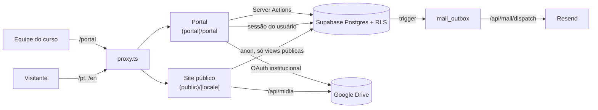
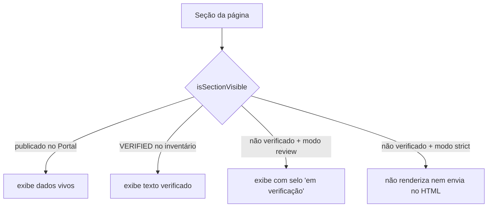
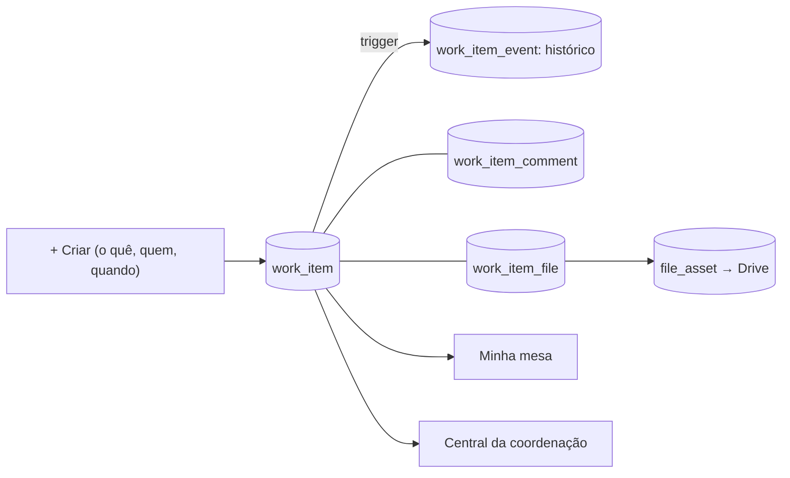
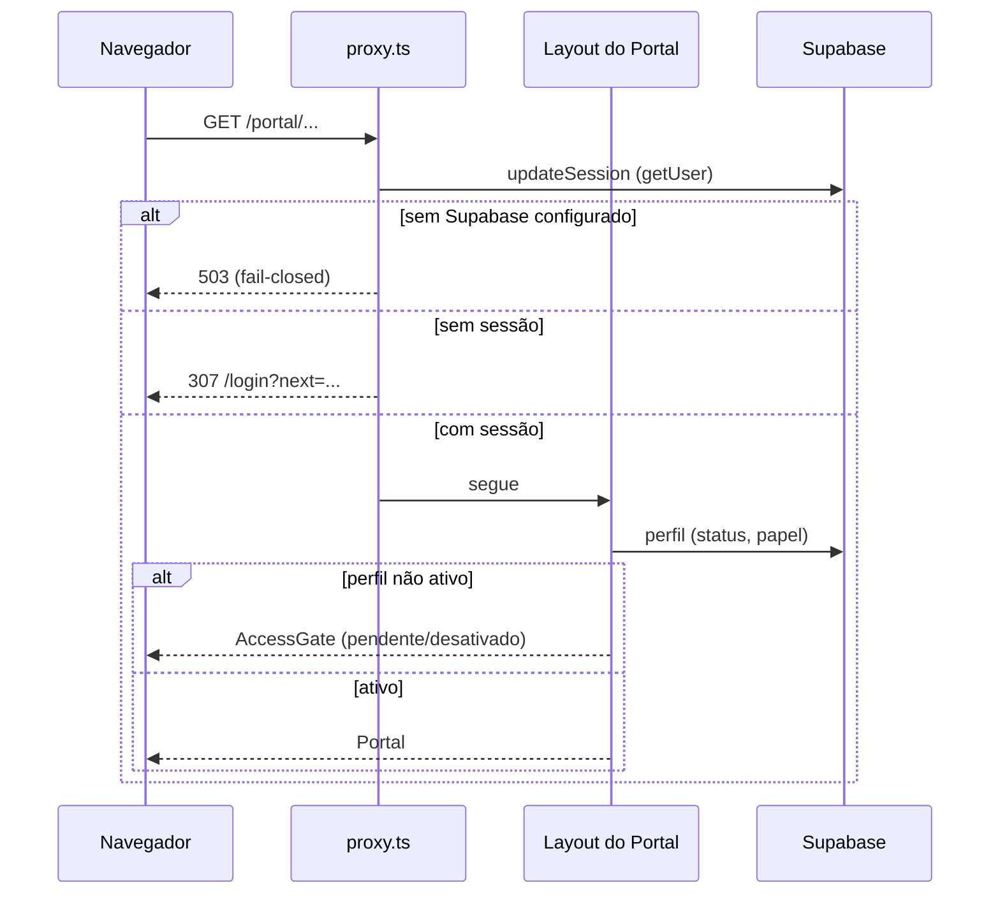
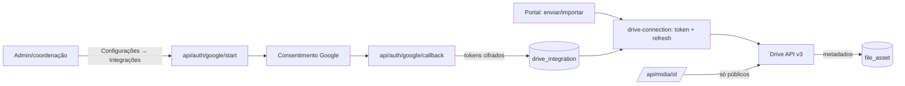

# Arquitetura

Como as partes do sistema se conectam. Onde fica cada arquivo:
`docs/PROJECT_STRUCTURE.md`.

## Visão geral

Um único app Next.js serve o site público e o Portal. O Supabase guarda
identidade, dados e regras de acesso; o Google Drive guarda os arquivos; a Vercel
hospeda (deploy a cada push em `main`).

## Frontend público

- Rotas em `src/app/(public)/[locale]`, sempre com prefixo `pt` ou `en`.
  Páginas são Server Components; interatividade só onde precisa (fluxograma,
  galeria, vídeo, menu, animações).
- Páginas com dados publicados usam ISR (`revalidate = 300`) e são revalidadas
  pelas Server Actions do Portal ao publicar.
- Cada bloco de texto institucional passa pela quarentena editorial:

  O modo vem de `NEXT_PUBLIC_CONTENT_MODE`, resolvido em `next.config.ts`
  (`strict` na produção da Vercel, `review` no resto).
- Fotos: `/api/midia/[id]?w=<largura>` busca a miniatura no Drive só se o arquivo
  estiver publicado, verificado, público e com consentimento
  (`public_file_info`). Larguras permitidas em `src/lib/content/media.ts`.
- SEO: `src/i18n/metadata.ts` (canonical, hreflang, OG), `sitemap.ts`,
  `robots.ts`, cartão OG em `/og/[locale]`.

## Portal

- Rotas em `src/app/(portal)/portal`, só PT por enquanto.
- Leitura: Server Components chamam `lib/portal/queries/*` com o cliente de
  sessão; a RLS filtra o que cada pessoa vê.
- Escrita: formulários (Client Components em `components/portal/<domínio>`)
  usam `useActionState` com Server Actions de `lib/portal/actions/*`. A ação
  valida cedo (espelho de `authz.ts`), grava com o cliente de sessão (a RLS
  decide), audita e devolve `ActionState`.
- Estados (projeto, missão, conteúdo, desafio) são máquinas de estado guardadas
  por trigger no banco; as constantes em `lib/portal/*-constants.ts` e
  `authz.ts` são espelhos para a interface.

## Ações (compromissos da administração e da coordenação)

- Camada transversal e privada: admin e coordenação veem tudo; outra pessoa só o
  item em que é responsável ou aprovadora (RLS). Quem não é da coordenação não
  altera responsável, prazo ou dados (trigger).
- Estados: planejada → em execução ⇄ aguardando (com "aguardando quem") /
  bloqueada → aguardando aprovação → concluída; cancelada. Só o aprovador aprova
  ou pede alteração (com nota); item com aprovador só conclui pela aprovação.
- O histórico é escrito pelo banco (status, aprovação, prazo, responsável,
  arquivos); a interface junta histórico e comentários numa linha do tempo.
- Arquivos: vínculo com `file_asset`; envio direto vai para
  `coordenacao/acoes/<ano>/<id>` no Drive. `can_view_file` libera o arquivo a quem
  vê a ação.

## Autenticação

- Login por Supabase Auth (`(auth)/login`, `lib/auth/actions.ts`); callback PKCE
  em `api/auth/callback`. Destinos de redirect passam por allowlist
  (`lib/auth/redirects.ts`).
- O OAuth do Google **não** autentica pessoas: só autoriza o Drive institucional.

## Supabase

- Schema, RLS, triggers e funções em `supabase/migrations` (em ordem de data).
  Principais grupos: identidade e auditoria, projetos e missões, CRM, arquivos,
  publicação, relatórios, e-mail, Drive, galeria de experiências, imagens do site,
  projetos públicos.
- Funções `security definer` com checagem explícita concentram operações
  sensíveis (`publish_content`, `submit_research_challenge`, `compute_indicators`).
- Auditoria append-only (`audit_event`, `activity_event`, `crm_event`).
- Clientes no app:

| Cliente | Arquivo | Quando usar |
|---|---|---|
| Sessão | `lib/supabase/server.ts` | Portal: Server Components, Server Actions, rotas autenticadas |
| Proxy | `lib/supabase/middleware.ts` | só no `proxy.ts` (renova cookie) |
| Público | `lib/supabase/public.ts` | site público: views/funções liberadas para `anon` |
| Admin | `lib/supabase/admin.ts` | só servidor, funções restritas ao service role: formulário público, `public_file_info` (foto pode ir ao site?), prévia por token, tokens do Drive, fila de e-mail |

## Google Drive

- Conexão única e institucional; escopos `drive.readonly` + `drive.file`.
- O banco guarda metadados, classificação, consentimento e verificação; os bytes
  nunca passam pelo Supabase.
- Detalhes, variáveis e troubleshooting: `docs/GOOGLE_DRIVE_INTEGRATION.md`.

## Controle de acesso

- Papel global (`profile.global_role`): `admin` e `coordination` supervisionam
  tudo; `advisor` acompanha desafios; `member` participa de projetos;
  `external`/`viewer` têm acesso limitado.
- Papel por projeto (`project_membership.role`): `leader`, `member`, `viewer`,
  `external`, com expiração opcional.
- Classificação de dados (`public`, `internal`, `restricted`, `administrative`)
  em projetos e arquivos.
- Três camadas: proxy (sessão) → layout (perfil ativo) → RLS (cada linha). A UI
  esconde o que a pessoa não pode fazer, mas quem nega é o banco.

## Internacionalização

- Site: `/{locale}/...`; dicionários tipados em `src/i18n/dictionaries`
  (mesmas chaves em PT e EN, verificado por teste). Conteúdo do banco tem colunas
  próprias em EN (`name_en`, `summary_en`...); sem tradução, a seção fica pendente
  em EN em vez de mostrar PT.
- Datas no fuso `America/Sao_Paulo` via `src/i18n/format.ts`.
- Portal: textos no dicionário PT (EN do Portal é decisão pendente).

## Temas

- Tokens semânticos em `src/app/globals.css` (`--bg-canvas`, `--text-primary`,
  `--action-primary`...), expostos como utilitários Tailwind (`bg-canvas`,
  `text-fg`, `border-line`...). Contraste AA testado.
- `HtmlShell` põe `data-theme` no `<html>`. Site público: sempre claro. Portal:
  preferência em cookie + `user_preference`, com script anti-flash para "sistema".

## Dados públicos vs privados

| Dado | Onde vive | Quem vê |
|---|---|---|
| Currículo, laboratórios | JSON versionado (`content/`) | todos |
| Textos institucionais | dicionários + inventário editorial | todos, se verificados |
| Notícias, eventos, experiências, projetos | tabelas internas → **projeção pública** após aprovação | site lê só a projeção |
| Fotos | Drive → `/api/midia` | só arquivos públicos, verificados e com consentimento |
| Pessoas, contatos, CRM, missões, relatórios | tabelas internas com RLS | só no Portal, conforme papel |
| Tokens do Drive, service role | cifrados no banco / env do servidor | nunca o navegador |

## Observabilidade e e-mail

- Logs JSON estruturados com redação de chaves sensíveis (`lib/observability`);
  erros do servidor via `instrumentation.ts`, do navegador via `/api/telemetry`;
  webhook opcional (`ERROR_SINK_URL`).
- E-mails nascem por trigger em `mail_outbox` e são entregues pela rota protegida
  `/api/mail/dispatch` (Resend); sem provedor, ficam na fila.
